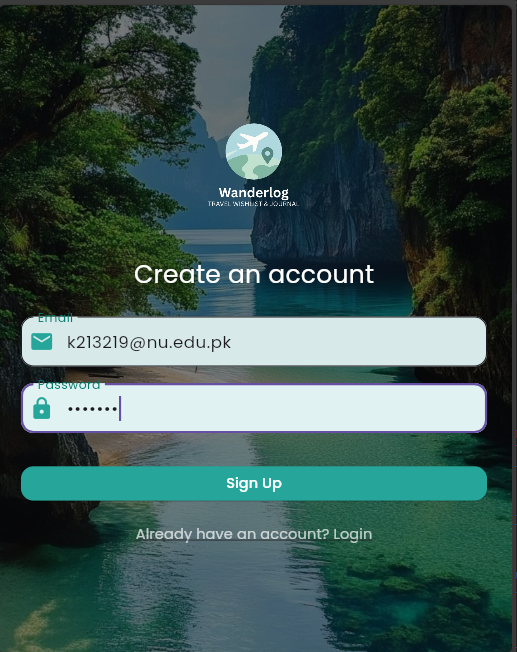
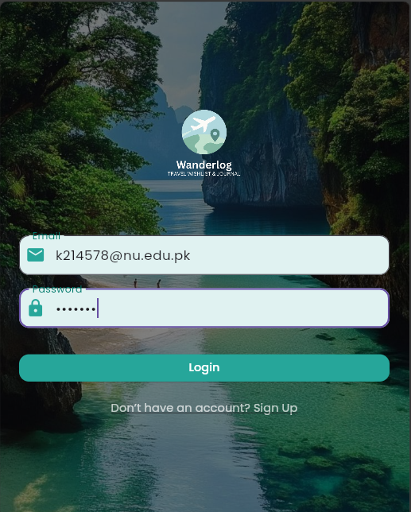
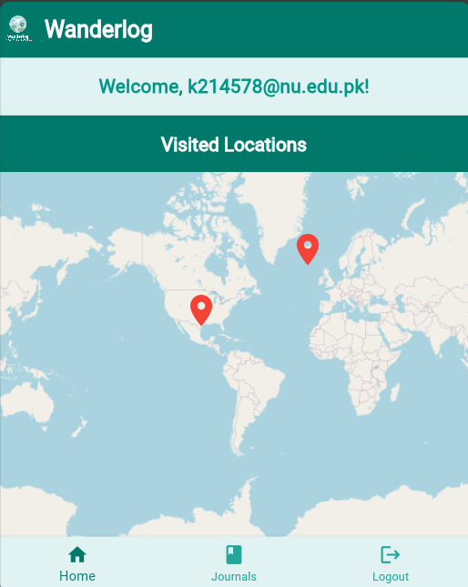
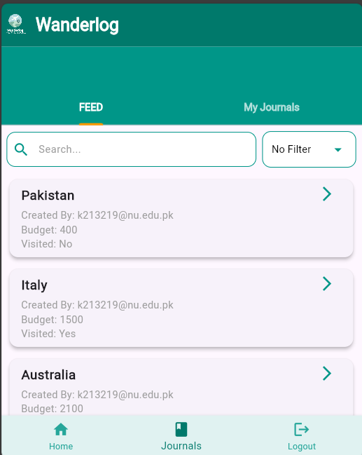
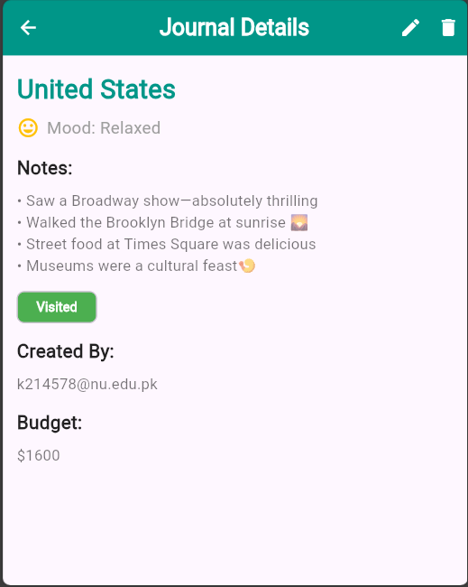
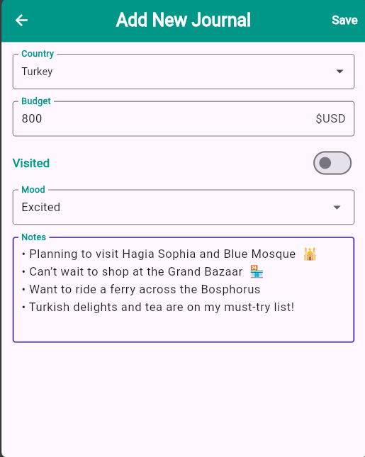
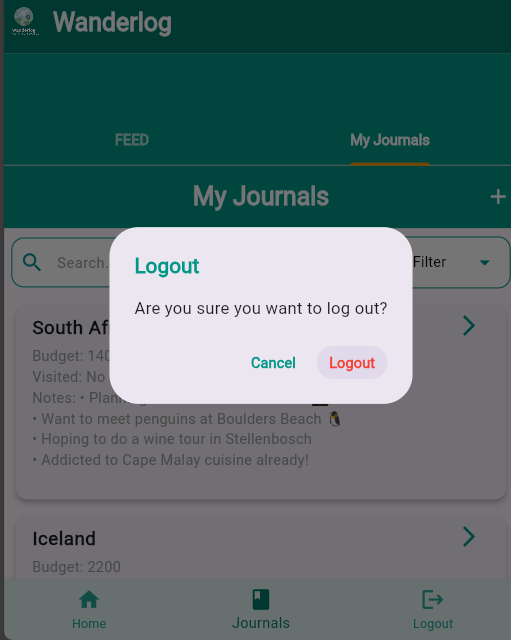

## 👥 Group Members — **GROUP 7**

1. **Muhammad Tahir** (21k-4503)  
2. **Syeda Samaha Batool Rizvi** (21k-4578)  
3. **Insha Javed** (21k-3279)  
4. **Muhammad Umer** (21k-3219)  

---

# 🧭 Travel Journal

**Travel Journal** is a Flutter application designed to help users document and share their travel experiences. The app allows users to create, edit, and view travel journals, complete with notes, moods, and location data. It integrates with Firebase for data storage and authentication and provides a map view to visualize visited locations.

---

## ✨ Features

- **📰 Journals Feed**  
  View journals created by other users. Apply filters or search to find specific entries.

- **📓 My Journals**  
  View your own journals and organize them with filters or search.

- **➕ Add New Journals**  
  Create a travel journal with details like location, budget, mood, and notes.

- **✏️ Edit Journals**  
  Update your journals anytime with new information or experiences.

- **🗑️ Delete Journals**  
  Remove journals you no longer want to keep.

- **🔍 View Journal Details**  
  Dive deep into your journal’s data including notes, mood, and budget.

- **🗺️ Map Integration**  
  Visualize visited locations using interactive maps.

- **🔥 Firebase Integration**  
  Journals and authentication are handled securely using Firebase Firestore and Auth.

- **🔐 Authentication**  
  Secure login and registration using Firebase Authentication.

- **📴 Offline Support**  
  Cached data allows journal access even without an internet connection.

---

## 🚀 Getting Started

### ✅ Prerequisites

- Flutter SDK (v3.7.2 or later)  
- Firebase Project with Firestore, Storage, and Auth configured  
- Android Studio / VS Code  
- Emulator or physical device


### 📦 Installation

1. **Clone the repository:**

   ```bash
   git clone https://github.com/your-username/travel-journal.git
   cd travel-journal

2. **Install dependencies:**

   ```bash
   flutter pub get
   ```

3. **Configure Firebase:**

   * Add your `google-services.json` (for Android) and `GoogleService-Info.plist` (for iOS) files to the respective directories.
   * Update the Firebase rules for Firestore and Storage as needed.

4. **Run the app:**

   ```bash
   flutter run
   ```

---

## 📁 Folder Structure

```
psckages/
├── auth_repo/
├── auth_ui/
lib/
├── journal/
│   ├── data/          # Data models and repository
│   ├── bloc/          # State management using Bloc
│   ├── presentation/  # UI components and pages
├── map/               # Map-related services
├── routes/            # App routing configuration
├── shared/            # Shared utilities and components
```

---

## 🔑 Key Dependencies

* `firebase_auth`: For user authentication
* `cloud_firestore`: For storing journal data
* `firebase_storage`: For uploading and retrieving images
* `flutter_bloc`: For state management
* `google_maps_flutter`: For map integration
* `dropdown_search`: For country selection
* `shared_preferences`: For local storage

---

## 📝 Usage

### ➕ Adding a Journal

* Navigate to the "Add Journal" page by tapping the "+" icon on the home screen.
* Fill in the required fields: place name, mood, notes, and budget.
* Optionally, upload an image and mark the location as visited.
* Tap **Save** to upload the journal to Firebase.

### ✏️ Viewing and Editing Journals

* Tap on a journal from the feed to view its details.
* Use the **Edit** button to update information.

### 🗺️ Map View

* Access the **Map View** to see all visited locations plotted on a map.

---

## 🔧 Firebase Configuration

Ensure your Firebase project is set up with:

* **Firestore**: For storing journal data
* **Storage**: For uploading and retrieving images
* **Authentication**: For user login and registration

Update the `pubspec.yaml` file with the required Firebase dependencies.

---

## 🤝 Contributing

Contributions are welcome!

1. Fork the repository
2. Create a new branch for your feature or bug fix
3. Commit your changes and push to your fork
4. Submit a pull request

---

## 📜 License

This project is licensed under the MIT License. See the `LICENSE` file for details.

---

## 📸 Screenshots

SignIn



Login



Map View 



Feed 


My Journals

Journal Details


Add Journal



Edit Journal


Signout



---

## 📚 Resources

* [Flutter Documentation](https://docs.flutter.dev)
* [Firebase Documentation](https://firebase.google.com/docs)
* [Bloc Library](https://bloclibrary.dev)

For any issues or questions, feel free to open an issue in the repository.

```
